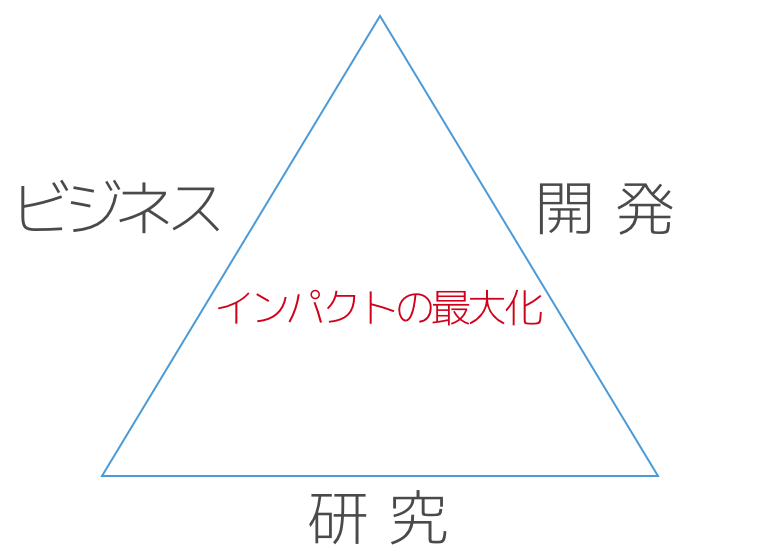

なぜ日本のIT技術は振るわないのか? それは、本来不可欠なはずの要素が欠けているからです。

  

思いついたアイディアを生かす道は、研究だけとは限りません。開発によって生かされるアイディア、ビジネスによって生かされるアイディアもあります。

田胡研では、アイディアを最も重要なものと考え、それを社会的価値に移転する方法を総合的に追求しています。

## 研究室紹介
田胡研では、以下の、大きく分野の異なるプロジェクトを意図的に並行して実施しています。研究室とは、いろいろな指向を持った人の間で”化学反応”を起こす炉だと考えているためです。

合言葉は「<strong>何か面白いもの作ろう!</strong>」

### 技術研究
- 実システムの開発を通じて、クラウドのインフラ技術、特に、ファイルシステム、通信、スケジューリング方式の検討を行なっています。

[詳細はこちら](./research/)

### 実践的なソフトウェアの開発
- 大学全体のクラウドの構築、運用を行いながら、開発したソフトウェアをオープンソース化しています。([クラウドサービスセンター](./development/cloud.html))
- エンターテインメント分野を対象とした、AIoT基盤の開発を、オープンソースプロジェクトとして実施しています。([iOtプロジェクト](https://www.iotaku.jp/))
- その他、種々のシステム開発

[詳細はこちら](./development/)

### ITビジネス実施とプランニング方法の検討
- エンジニアを対象として、ビジネススキル習得法を検討し、実際に育成プログラムを提供しています。
- スタートアップ支援を行っています。

[詳細はこちら](./business/)

## 背景
上記3つは、それぞれ、要素技術に関するアイディア、システム設計に関するアイディア、ビジネスアイディアに基いています。自分が興味を持てる分野に関してよく考えてアイディアを出せるようにするとともに、どのような分野のアイディアであっても有効に生かせるような訓練を積みます。

これらを活動項目としてとりあげたのは、偶然ではありません。研究、開発によって生み出されたアイディアは、いずれかの時点で社会に適用されてはじめて最終的な評価が決まります。したがって、技術を志す者は、個々のアイディアがどのような経緯を経て社会に適用されるのか知っている必要があります。多くの分野において、我が国の技術水準は世界に冠たるものがありますが、そのせっかくの技術がビジネスに十分に生かされないケースが多見されます。それは、長期的には、技術水準自体の地盤沈下をもたらします。その主要な原因が、人材育成にあると考えています。技術を生み出す人材と、それを利用して社会に適用する人材が同じ場所で活動して相互に理解できるようになることは、人材育成の点からきわめて重要です。これが、異なる価値観、方向性、目標を持った人材を一つの研究室に収容して活動を続ける理由です。
