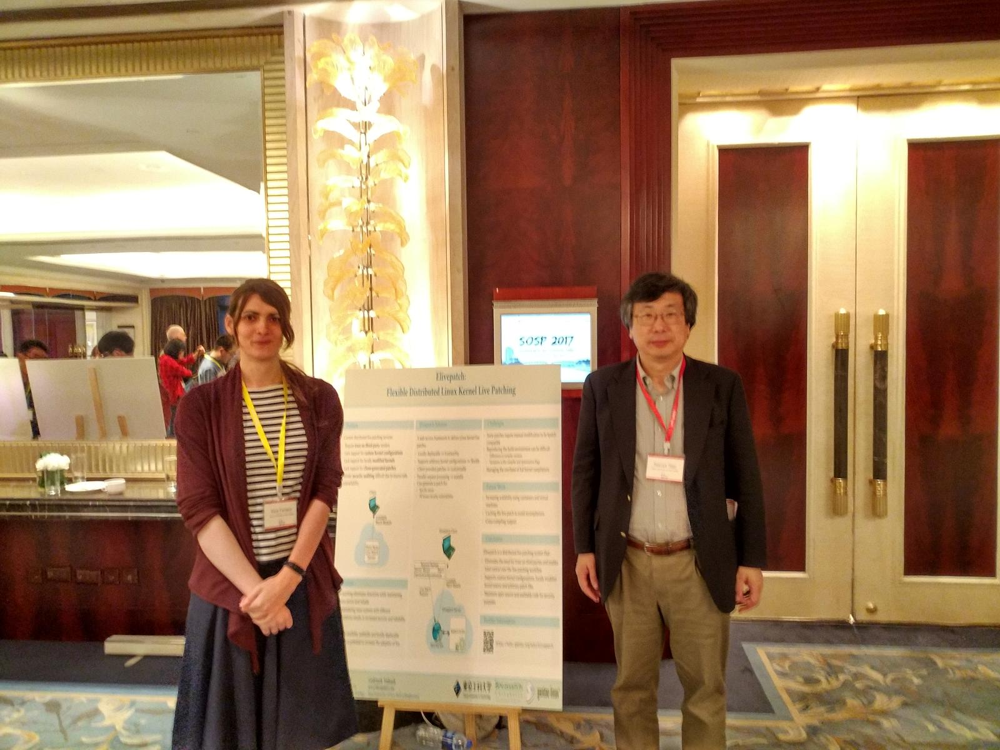

# 研究活動

田胡研で行っている開発活動と連携して、  
* 開発の過程で見いだされた技術課題の解決  
* 研究アイディアの、開発コミュニティへのトランスファー  

を目的とした研究活動を行っています。

10年ほど前に、ニューラルネットを用いた、ファイルシステムのキャッシュメモリスケジューリング機構を実現し、成果をあげました。また、リアルタイム通信機構の実現方式についても検討を行いました。このような背景に基づき、現状では、クラウドシステムに関するインフラ技術の検討を行っています。

## Docker向けの新しいストレージレイヤの提案
分散環境におけるデータ管理では、ファイル等のレコードがimmutableであれば、その扱いは極端に単純化できます。最近、dockerやgit等、データ管理に関連するアプリケーションにおいてバージョン管理を行うものが増えています。バージョン管理が行われたデータ管理システムでは、バージョンが確定したレコードはimmutableになります。この性質を有効に利用すると、クラスタ環境におけるdocker運用のためのデータ管理機構を、従来とことなる考え方に従って、より効率的かつ単純に実現できるようになると考えております。このようなアプローチ、および、それに適した分散環境でのレコード配置スケジューリング方式について研究を行なっています。
すでにプロトタイプとなるEltonシステムが実装されているので、これに基づいた全体機構を構築し、評価を行う予定です。

## IoTシステム向きのリアルタイム通信機構  
IoTシステムでは、たとえばビデオカメラのデータ出力を、実時間性を持ってサーバに伝達する必要がしばしば生じます。このような系は、単位時間ごとに、コネクションごとの流量を保障することによって実現されます。流量保障の方式や、スケジューリング方針に関する研究を行っています。

## IoTクラウド向き資源スケジューラ   
IoTアプリケーションを実行しているクラウドにおける資源消費状況から適切なスケジューリングを行うための、機械学習を用いた機構に関する研究を行っています。  

---

以上の研究は、アイディアをまとめた後は、海外企業や開発コミュニティへの提案を行うことを目標としています。

SOSP 2017 Alice Ferrazziのポスター発表  
  

Alice FerrazziはGentoo LinuxのKernel Leadで、田胡研OGです。
